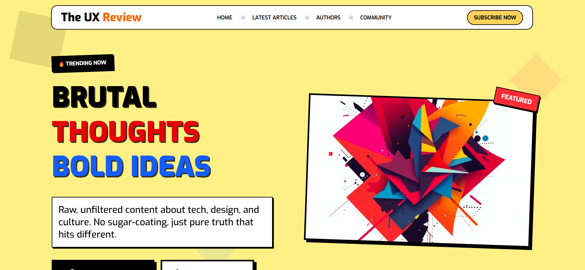

# 🚀 The UX Review Blog

A modern and bold blog landing page built with **HTML & CSS** that highlights articles about **technology, design, and digital culture**.

---

## 🌐 Live Demo

🔗 [https://nada-mahrous.github.io/The-UX-Review-Blog/](https://nada-mahrous.github.io/The-UX-Review-Blog/)

---

## 📸 Project Preview

---

## 📖 Overview

The **UX Review Blog** is a front-end project designed to simulate a modern editorial blog website.  
The layout focuses on presenting articles in a clean and engaging way while maintaining strong visual hierarchy and readability.

The page includes sections for featured articles, trending topics, author profiles, and community engagement.

---

## ✨ Features

- 📰 Modern blog landing page  
- 🎯 Hero section with strong visual design  
- 📚 Latest articles section  
- 🔥 Trending topics section  
- 👩‍💻 Authors showcase  
- 💬 Community section  
- 📩 Newsletter subscription  
- 📱 Responsive layout  

---

## 🛠 Built With

- 🧱 HTML5
- 🎨 CSS3

---

## 🧠 What I Practiced

- Structuring multi-section web pages  
- Creating clean and reusable layouts  
- Working with spacing and alignment  
- Improving visual hierarchy  
- Building responsive layouts using CSS  

---

## 📂 Project Structure

---

## 👩‍💻 Author

**Nada Mahrous**  
Front-End Developer

---

## 💡 Feedback

Feedback and suggestions are always welcome!  
If you like the project, feel free to ⭐ the repository.
